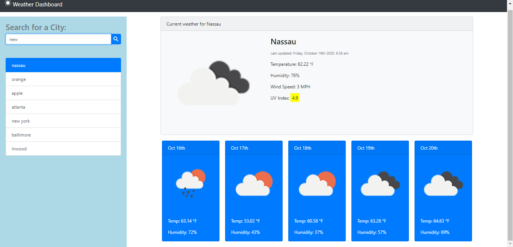

# Weather-Dashboard-app

[Click to got to weather-app page]( https://adrianstorr.github.io/Weather-Dashboard-app/)

This is my weather application: The application works when the user enters a city to search. Once the user selects the city the  api linked in js file will link information back to html displaying the current weather of selection. Along with the current weather the html will display humidity, wind, and UV index which were all linked together with weather api.

