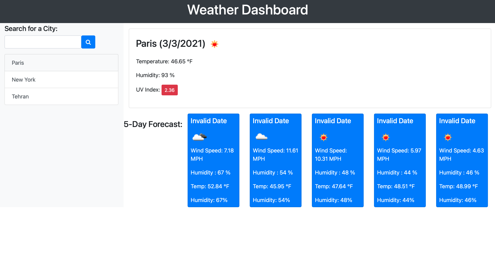

# Weather Dashboard

This app lets you see the weather in different cities!

## Description

[Deployment](https://farannavazi.github.io/weather-app/)

This is a weather app that helps you find the current weather and forecasted weather for your desired city.

## Technologies

- HTML
- Bootstrap
- Javascript
- jQuery

## Installation

No installation needed.

## Usage

You enter the name of the city you want to search for in the search field. Once you submit, you will see the current and forecast weather of the city. You can click the previous cities you searched on for their weather too. Your searched cities are saved to your local storage for convience use.

## Credits

Faran Navazi
[Github](https://github.com/FaranNavazi)
[LinkedIn](https://www.linkedin.com/in/farannavazi/)
